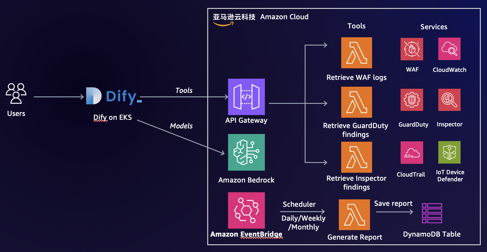

# OpsAssistant

OpsAssistant is a GenAI chatbot built with Amazon Bedrick and Dify, aimed to retrive and analyze AWS service metrics, logs, findings, and output insights.  It also support to generate Daily/Weekly/Monthly report automatically, and can be retrieval easily.

Supported services:

- WAF logs
- GuardDuty findings
- Inspector findings
- Daily/Weekly/Monthly security reports
- IoT Device Defender
- CloudTrail (in progress)
- Code review(in progress)
- Document review(in progress)

More service data retriveling is on going.

## Architecture



## Code Structure

This project contains source code and supporting files for a serverless application that you can deploy with the SAM CLI. It includes the following files and folders.

```
.
├── README.md
├── assets
│   └── images
├── code                # Code for the application's Lambda function.
│   ├── cloudtrail
│   ├── ec2
│   ├── guardduty
│   ├── inspector
│   └── waf
├── doc
├── events              # Invocation events that you can use to invoke API gateway.
├── template.yaml	# A template that defines the application's AWS resources.
└── tests		# Unit tests for the application code.
    ├── integration
    └── unit

```

The application uses several AWS resources, including Lambda functions and an API Gateway API. These resources are defined in the `template.yaml` file in this project. You can update the template to add AWS resources through the same deployment process that updates your application code.

## Deploy the application

The Serverless Application Model Command Line Interface (SAM CLI) is an extension of the AWS CLI that adds functionality for building and testing Lambda applications. It uses Docker to run your functions in an Amazon Linux environment that matches Lambda. It can also emulate your application's build environment and API.

To use the SAM CLI, you need the following tools.

* SAM CLI - [Install the SAM CLI](https://docs.aws.amazon.com/serverless-application-model/latest/developerguide/serverless-sam-cli-install.html)
* [Python 3 installed](https://www.python.org/downloads/)
* Docker - [Install Docker community edition](https://hub.docker.com/search/?type=edition&offering=community)

To build and deploy your application for the first time, run the following in your shell:

```bash
sam build --use-container
sam deploy --guided
```

The first command will build the source of your application. The second command will package and deploy your application to AWS, with a series of prompts, such as

* **Stack Name**: The name of the stack to deploy to CloudFormation. This should be unique to your account and region, and a good starting point would be something matching your project name.
* **AWS Region**: The AWS region you want to deploy your app to.
* **Parameter WAFLogGroup:** Specify WAF CloudWatch logs group
* **Parameter WAFLogRegion:** Specify WAF CloudWatch logs region
* **Parameter GuarddutyDetectorID:**  Specify GuardDuty Detector ID
* **Parameter SNSTopicsARN:** Specify SNS topics ARN, used to send security reports
* **Parameter AuthToken:** Specify API Gateway Authorizer token, suggested using `openssl rand -base64 42` to generate strong token
* **Confirm changes before deploy**: If set to yes, any change sets will be shown to you before execution for manual review. If set to no, the AWS SAM CLI will automatically deploy application changes.
* **Allow SAM CLI IAM role creation**: Many AWS SAM templates, including this example, create AWS IAM roles required for the AWS Lambda function(s) included to access AWS services. By default, these are scoped down to minimum required permissions. To deploy an AWS CloudFormation stack which creates or modifies IAM roles, the `CAPABILITY_IAM` value for `capabilities` must be provided. If permission isn't provided through this prompt, to deploy this example you must explicitly pass `--capabilities CAPABILITY_IAM` to the `sam deploy` command.
* **Save arguments to samconfig.toml**: If set to yes, your choices will be saved to a configuration file inside the project, so that in the future you can just re-run `sam deploy` without parameters to deploy changes to your application.

You can find your API Gateway Endpoint URL in the output values displayed after deployment.

## Use the SAM CLI to build and test locally

Build your application with the `sam build --use-container` command.

```bash
OpsAssistant$ sam build --use-container
```

The SAM CLI installs dependencies defined in `requirements.txt`, creates a deployment package, and saves it in the `.aws-sam/build` folder.

The SAM CLI can also emulate your application's API. Use the `sam local start-api` to run the API locally on port 3000. `-n` option to specify JSON file containing values for Lambda function's environment variables.

```bash
OpsAssistant$ sam local start-api -n locals.json
OpsAssistant$ curl http://localhost:3000/
```

The SAM CLI reads the application template to determine the API's routes and the functions that they invoke. The `Events` property on each function's definition includes the route and method for each path.

```yaml
      Events:
        OpsAssistant:
          Type: Api
          Properties:
            Path: /tools/waf
            Method: get
```

Test a single api by invoking it directly with a test event. An event is a JSON document that represents the input that the function receives from the event source. Test events are included in the `events` folder in this project. Test the api locally using curl as follow:

```bash
OpsAssistant$ curl --location 'http://localhost:3000/tools/waf' --header 'Content-Type: application/json' --data @events/waf_event.json
OpsAssistant$ curl --location 'http://localhost:3000/tools/guardduty' --header 'Content-Type: application/json' --data @events/guardduty_event.json
OpsAssistant$ curl --location 'http://localhost:3000/tools/inspector' --header 'Content-Type: application/json' --data @events/inspector_event.json
OpsAssistant$ curl --location 'http://localhost:3000/tools/iotsecurity' --header 'Content-Type: application/json' --data @events/iot_security_event.json
```

Run functions locally and invoke them with the `sam local invoke` command.

```bash
OpsAssistant$ sam local invoke ReportsFunction --event events/report_event.json --env-vars locals.json
```

## Fetch, tail, and filter Lambda function logs

To simplify troubleshooting, SAM CLI has a command called `sam logs`. `sam logs` lets you fetch logs generated by your deployed Lambda function from the command line. In addition to printing the logs on the terminal, this command has several nifty features to help you quickly find the bug.

`NOTE`: This command works for all AWS Lambda functions; not just the ones you deploy using SAM.

```bash
OpsAssistant$ sam logs -n WafFunction --stack-name "OpsAssistant" --tail
```

You can find more information and examples about filtering Lambda function logs in the [SAM CLI Documentation](https://docs.aws.amazon.com/serverless-application-model/latest/developerguide/serverless-sam-cli-logging.html).

## Cleanup

To delete the application that you created, use the AWS CLI. Assuming you used your project name for the stack name, you can run the following:

```bash
sam delete --stack-name "OpsAssistant"
```

## Resources
